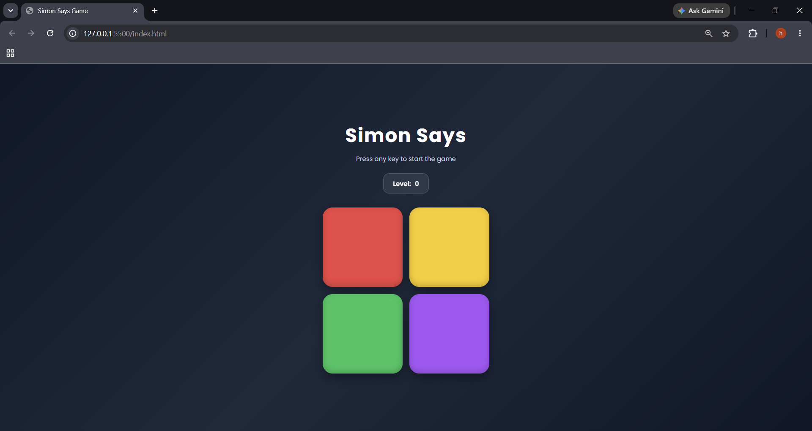

# Simon Says Game

An interactive Simon Says memory game built using **HTML, CSS, and JavaScript**. Test your memory by repeating an increasingly long sequence of colors. The game becomes more challenging as you progress through higher levels.

## 🚀 Features

* Interactive gameplay
* Random color sequence generation
* Level progression system
* Real-time sequence validation
* Responsive design
* Smooth button animations and visual effects
* Game over detection and restart functionality

## 🛠️ Technologies Used

* HTML5
* CSS3
* JavaScript (ES6)

## 🎮 How to Play

1. Press any key to start the game.
2. Watch the color that flashes.
3. Click the colors in the same order.
4. Each new level adds one more color to the sequence.
5. If you click the wrong color, the game ends.
6. Press any key to restart and try again.

## 📂 Project Structure

```text
Simon-Says-Game/
│
├── index.html
├── style.css
├── script.js
└── README.md
```

## 📸 Preview




## 🔧 Installation

1. Clone the repository:

```bash
git clone https://github.com/himeshnama007/Simon-Says-Game.git
```

2. Navigate to the project folder:

```bash
cd Simon-Says-Game
```

3. Open `index.html` in your browser.

## 🌐 Live Demo

Add your GitHub Pages link here:

```text
https://himeshnama007.github.io/Simon-Says-Game/
```

## 📈 Future Improvements

* Sound effects
* High score tracking using Local Storage
* Difficulty levels
* Mobile touch enhancements
* Leaderboard system

## 👨‍💻 Author

Himesh Nama

If you like this project, consider giving it a ⭐ on GitHub.
